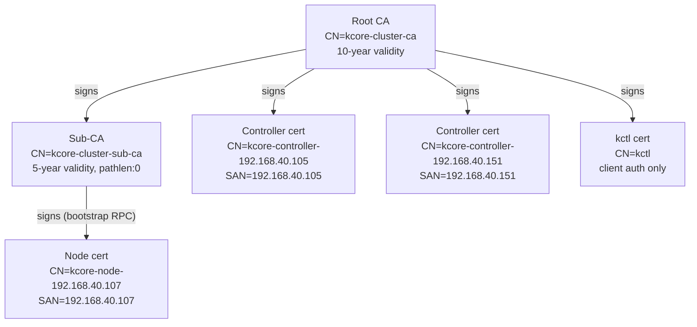
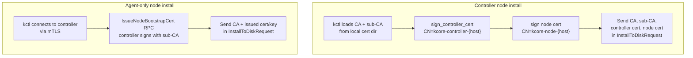
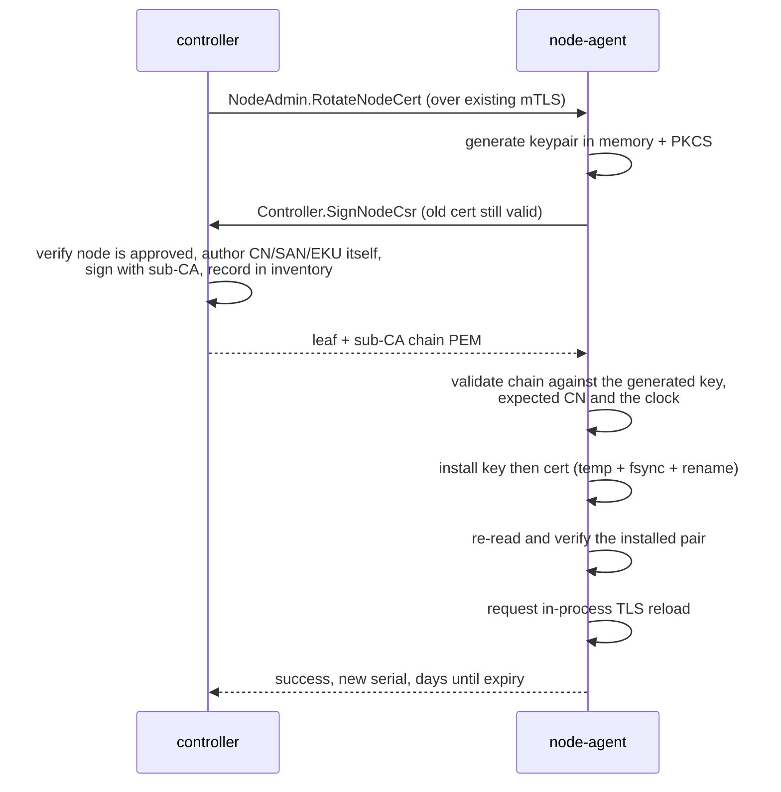

# mTLS Bootstrap and Authentication

This document explains how cluster certificates are created, how they are installed on nodes, and how mTLS is enforced between `kctl`, `kcore-controller`, and `kcore-node-agent`.

## Certificate hierarchy



Every controller gets a **unique CN** (`kcore-controller-{host}`) so replication peer identity tracking is unambiguous. Node-agent authorization uses prefix matching (`kcore-controller-`) to accept any controller in the cluster.

## 1) Certificate and CA creation

Cluster PKI is generated with:

```bash
kctl create cluster --controller <controller-host:9090> --context <name>
```

The command creates:

- `ca.crt` / `ca.key`: cluster root Certificate Authority (10-year validity)
- `sub-ca.crt` / `sub-ca.key`: intermediate sub-CA for automatic node cert renewal (5-year, pathlen:0)
- `controller.crt` / `controller.key`: controller identity with host-specific CN `kcore-controller-{host}` (server + client auth)
- `kctl.crt` / `kctl.key`: CLI client identity with CN `kctl` (client auth only)

Files are stored under `~/.kcore/<context-name>/` and the active context in `~/.kcore/config` is updated with **inline base64-encoded cert data**:

```yaml
current-context: prod
contexts:
  prod:
    controller: 192.168.40.105:9090
    controllers:
      - 192.168.40.105:9090
      - 192.168.40.151:9090
    ca-data: <base64(ca.crt PEM)>
    cert-data: <base64(kctl.crt PEM)>
    key-data: <base64(kctl.key PEM)>
```

Inline data takes precedence over file paths. No silent fallback to `~/.kcore/certs/` occurs; if no credentials are configured, `kctl` returns a clear error.

### Guard against accidental CA replacement

Running `kctl create cluster` when a context already has TLS credentials is **refused** unless `--force` is passed. This prevents silently generating a new CA that breaks connections to existing controllers.

## 2) Node install bootstrap (cert persistence)

Two install paths exist depending on whether the node will run a controller:

### Controller node (`--run-controller`)

`kctl` generates a **fresh controller certificate** for the target host using `sign_controller_cert`:

1. Loads root CA, CA key, sub-CA cert, and sub-CA key from the local cert dir.
2. Generates a controller cert with CN `kcore-controller-{node_host}` and SAN matching the host IP.
3. Generates a node cert signed by the root CA.
4. Sends CA, sub-CA, controller cert/key, and node cert/key in `InstallToDiskRequest`.

### Agent-only node (`--join-controller`)

`kctl` requests a bootstrap certificate from the target controller:

1. Connects to the primary controller via the `IssueNodeBootstrapCert` RPC.
2. The controller signs a node cert using its **sub-CA** with CN `kcore-node-{host}` and SAN = host.
3. `kctl` reads the root CA from the local cert dir and sends it along with the controller-issued node cert/key.



### Files written on the installed node

The node-agent receives cert PEM fields and writes them to `/etc/kcore/certs/`:

| File | Present on | Signed by |
|------|-----------|-----------|
| `ca.crt` | all nodes | self-signed (trust anchor) |
| `node.crt` / `node.key` | all nodes | root CA (controller install) or sub-CA (agent install) |
| `controller.crt` / `controller.key` | controller nodes | root CA |
| `sub-ca.crt` / `sub-ca.key` | controller nodes | root CA |

Before the OS install finishes, the installer copies `/etc/kcore/*` into `/mnt/etc/kcore` on the target disk. This is what persists certs across reboot into the installed KcoreOS system.

## 3) Runtime mTLS authentication

### Identity and authorization

Components authenticate each other by Common Name (CN) extracted from the client certificate:

| Component | CN pattern | Authorization check |
|-----------|-----------|---------------------|
| kctl (legacy bootstrap) | `kctl` | exact match; treated as **cluster-admin** only while the `operators` table is empty, or when `auth.bootstrap_kctl: true` in controller config — otherwise denied |
| kctl (named operator) | `kctl:<name>` | must exist in `operators` with at least one role; effective capability is the highest of assigned roles (`read-only` < `vm-admin` < `cluster-admin`) |
| Controller | `kcore-controller-{host}` | prefix match `kcore-controller-` |
| Node agent | `kcore-node-{host}` | prefix match `kcore-node-` |

Prefix matching allows any controller in the cluster to call any node-agent, and controllers to authenticate to each other for replication, without pre-registering exact CNs.

### Operator RBAC (controller APIs)

Human-facing controller RPCs (anything that used to allow `CN=kctl` together with peer controllers) now require a **minimum role**:

- **read-only** — `Get*` / `List*` / `Classify*` / `Plan*` style calls and reports.
- **vm-admin** — read-only plus VM/workload/network/security-group/SSH-key writes, desired-state changes, and serial console (`AttachVmConsole`). Successful console attaches are recorded in the append-only audit log (`AttachVmConsole` / `vm/<name>`).
- **cluster-admin** — full access including node lifecycle, PKI (`RotateSubCa`, `ReloadTls`, node bootstrap cert), disk layouts, cluster updates, operator administration, and `IssueOperatorCert`.

Peer controller certificates (`kcore-controller-*`) still authenticate as **cluster-admin** on the shared `Controller` service (for replication pull/apply and similar). They are **not** accepted on the separate `ControllerAdmin` service (`ApplyNixConfig`, replication introspection RPCs used from `kctl`): those require a human operator cert (`kctl` or `kctl:<name>`).

Roles are stored in SQLite (`operators`, `operator_roles`) and replicate across controllers like other cluster objects.

**Bootstrap flow**

1. `kctl create cluster` still produces the legacy client cert `CN=kctl` (often embedded in context config).
2. While no operators exist, that cert acts as cluster-admin so you can run `kctl operator create alice`, `kctl operator grant-role alice --role cluster-admin`, and `kctl operator issue-cert alice`.
3. Material lands under `~/.kcore/operators/alice/operator.{crt,key}`; use `kctl --as alice ...` (or `operator:` in the context) for subsequent calls.
4. After the first operator exists, legacy `CN=kctl` is rejected unless you set `auth.bootstrap_kctl: true` on the controller (escape hatch only).

See also: `kctl get compliance-report` → **access_control** lists each RPC with `required_operator_role`.

### `kctl` -> `controller` and `kctl` -> `node-agent`

- `kctl` uses `https://...` unless `--insecure` is set.
- It requires CA cert + client cert + client key in secure mode.
- Server identity is validated by CA trust and SAN matching.
- Client identity is presented to server via mTLS.

### Pre-flight TLS validation

Before attempting any TLS handshake, `kctl` performs pre-flight checks on the configured credentials:

1. **CA/cert chain mismatch** -- verifies the client certificate's signature chains up to the configured CA (supports direct signing and intermediate sub-CA chains). Fails with: `"client certificate was signed by a different CA than the configured trust root"`.
2. **Expired client cert** -- checks not-after date. Fails with: `"client certificate expired on {date}"`.
3. **Expired CA cert** -- checks CA not-after date. Fails with: `"CA certificate expired on {date}"`.

These checks produce actionable error messages instead of opaque "transport error" failures.

### `controller` server and `node-agent` server

Both services support TLS config in YAML:

```yaml
tls:
  caFile: /etc/kcore/certs/ca.crt
  certFile: /etc/kcore/certs/<service>.crt
  keyFile: /etc/kcore/certs/<service>.key
```

When TLS is configured, each server:

- serves TLS with its cert/key
- requires client certificate signed by `caFile` (`client_ca_root`)

### `controller` -> `node-agent`

Controller uses the same configured CA + identity to open outbound connections to node-agent:

- secure path: `https://<node-host:9091>` with client cert
- fallback path: `http://...` only if controller TLS is not configured

### `controller` <-> `controller` (replication)

Controllers authenticate to each other using their host-specific controller certificates. The replication peer identity is derived from the connecting controller's CN (e.g., `kcore-controller-192.168.40.105`), which is used to track per-peer replication ack frontiers.

## 4) Certificate lifecycle: inventory, rotation and revocation

Node certificates are valid for 1 year by default (`certRotation.certValidityDays`). The controller owns the whole lifecycle: it records every certificate it issues, rotates them ahead of expiry, and publishes revocations as a signed CRL and over OCSP.

### 4.1 Certificate inventory

Every certificate the controller signs — node bootstrap certs, CSR-based rotations, operator certs — is recorded in the `issued_certificates` table (DB schema version 33):

| Column | Meaning |
|--------|---------|
| `serial_hex` | uppercase hex of the DER serial integer, matching `openssl x509 -serial` |
| `subject_cn`, `identity_kind` | subject CN and one of `node` / `operator` / `controller` / `sub-ca` |
| `node_id` | node this identity belongs to, empty for operators |
| `issuer_cn`, `fingerprint_sha256` | issuing CA CN, and lowercase hex SHA-256 of the DER certificate |
| `not_before`, `not_after`, `issued_at` | RFC3339 UTC, second precision |
| `status` | `active` / `rotated` / `revoked` |
| `revocation_reason`, `revoked_at` | RFC 5280 reason code and time; `-1` / empty when not revoked |

Issuing a new certificate for an identity demotes the previous `active` row to `rotated`. A `rotated` certificate is still cryptographically valid until its `not_after` — it is superseded, not revoked. Only `revoked` rows appear on the CRL.

The inventory is the single source of truth for both the CRL and the OCSP responder, so there is no second store to keep in sync.

```bash
kctl get certificates
kctl get certificates --node dell-1 --status active
kctl get certificates --expiring-within-days 30
```

### 4.2 Automated rotation (CSR-based, keys stay on the node)

The controller runs a **certificate rotation reconciler** (`crates/controller/src/cert_rotation_reconciler.rs`), in the same style as the Ceph and cluster-update reconcilers. On every tick (`certRotation.checkIntervalSecs`, default 1 h) it:

1. refreshes the in-memory revoked-serial set used by the authorization path;
2. regenerates and republishes the CRL if it is due;
3. logs a warning for each active certificate inside `certRotation.warnBeforeDays`;
4. calls `NodeAdmin.RotateNodeCert` on every node whose certificate is inside the renewal window.

A certificate is **due for renewal** when *either* fewer than `certRotation.renewBeforeDays` remain *or* less than `certRotation.renewAtLifetimeFraction` of its total lifetime remains. The absolute floor is what operators think in; the fraction rule is what makes short-lived certificates rotate sanely. Both the controller and the node-agent evaluate the identical rule, so a controller-driven rotation and the node's own timer never disagree.

Rotation itself is driven by the node, and the private key never leaves it:



The ordering is what makes this non-disruptive:

- The CSR is submitted while the **old** certificate is still valid and trusted, so the call authenticates normally.
- The signed chain is validated **before** anything is written: it must parse, carry the expected CN, not be expired, and its SubjectPublicKeyInfo must equal the key the node just generated. A controller that returns junk cannot break a working node.
- Both files are written with write-temp-in-the-same-directory + `fsync` + `rename`, and the directory is fsynced afterwards. A reader never sees a partial file; a crash mid-install leaves either the old or the new bytes.
- The key is written before the cert, so the only window where the two disagree is the one where the *old* certificate is still the one being served.
- After installing, the node re-reads what it wrote and checks the serial and key match. If that fails it **rolls back** to the previous bytes and reports failure.
- Only then is a TLS reload requested.

Any failure at any step leaves the node serving on its existing certificate, and the reconciler retries on the next tick. A failed rotation is never worse than no rotation.

The controller also authors the CN, SANs and extended key usages itself when signing a CSR. The CSR contributes **only** its public key (whose possession `rcgen` proves via the CSR self-signature). A CSR that requests a CN or SAN for a different host is rejected outright rather than silently rewritten.

`RenewNodeCert` — the older RPC that generated the key on the controller and returned it over the wire — still exists for compatibility with pre-rotation node-agents, but the node-agent no longer calls it.

**Operator-triggered rotation**

```bash
kctl rotate node-certs --node dell-1
kctl rotate node-certs --all
```

Per-node results are printed with the new serial. Partial failure exits non-zero; the nodes that did not rotate keep working on their existing certificates.

### 4.3 In-process TLS reload

`tonic` 0.12 bakes the `rustls` `ServerConfig` into the `Server` when `tls_config` is called and offers no way to swap the certificate on a live server. Both the controller and the node-agent therefore reload by **rebuilding the listener inside the same process**: the serve loop runs `serve_with_shutdown` with a future that completes on a reload request, then loops round and re-reads the TLS material from disk.

This is a process-preserving reload — no `exec`, no `systemctl restart`, no lost in-memory state (live-migration bookkeeping, VMM sockets, storage handles). It does close established gRPC connections, which all KCore clients already retry, and `serve_with_shutdown` drains in-flight requests before returning.

The controller additionally reloads on `SIGHUP`. Neither component SIGTERMs itself after a rotation any more.

### 4.4 Revocation

```bash
kctl revoke cert --serial 0A1B2C3D --reason key-compromise
kctl revoke cert --node dell-1  --reason cessation-of-operation
kctl revoke cert --subject kctl:alice --reason privilege-withdrawn
```

`--reason` takes the RFC 5280 §5.3.1 names (`unspecified`, `key-compromise`, `ca-compromise`, `affiliation-changed`, `superseded`, `cessation-of-operation`, `certificate-hold`, `remove-from-crl`, `privilege-withdrawn`, `aa-compromise`) or the bare numeric code. Code 7 is unused by the RFC and is rejected.

Revoking marks the inventory row `revoked`, adds the serial to the controller's in-memory set immediately (so it takes effect on the very next RPC, not on the next refresh tick), and regenerates the CRL straight away.

**Enforcement.** `tonic::transport::ServerTlsConfig` builds its rustls config internally and accepts no custom `ClientCertVerifier`, so rustls' own CRL support (`WebPkiClientVerifier::with_crls`) is unreachable. Enforcement happens one layer up instead: a `tonic` interceptor on every service checks the serial of the presented client certificate against the revocation set before any handler runs. One wiring point covers every RPC.

- On the **controller**, the set comes straight from `issued_certificates`, so it is authoritative and always fresh.
- On the **node-agent**, the set comes from a CRL fetched over the existing mTLS gRPC channel (`Controller.GetCrl`) every `revocation.fetchIntervalSecs`. The CRL signature is verified against the configured trust bundle (`ca.crt` plus the sub-CA shipped in the node's own chain) before it is trusted — an unverified CRL would let anyone who can answer `GetCrl` decide which certificates the node rejects. Nodes need no extra network path and no extra credential.

A revoked serial is rejected with `PermissionDenied` regardless of how stale the data is: stale data can miss new revocations, it can never invent them.

**Failure modes.** When revocation data cannot be refreshed within `revocation.maxStalenessSecs`:

| Mode | Behaviour | When to use |
|------|-----------|-------------|
| `soft-fail` (**default**) | Keep accepting peers absent from the last known set, and log a warning per rejected-freshness check. | Everywhere by default. A controller outage or a transient fetch failure must not lock every node out of its own cluster. |
| `hard-fail` | Reject every peer with `Unavailable` until fresh data arrives. | High-assurance environments where availability is subordinate to revocation certainty. Understand that a controller outage will stop the cluster. |

Stale data under `hard-fail` returns `Unavailable`, not `PermissionDenied`: it is an availability problem, not an authorization decision, and callers should retry.

### 4.5 CRL and OCSP endpoints

The controller serves plain-HTTP PKI endpoints on `pki.httpListenAddr` (default `0.0.0.0:9092`):

| Endpoint | Content type | Purpose |
|----------|--------------|---------|
| `GET /pki/crl.der` | `application/pkix-crl` | DER CRL, for `openssl crl -inform DER` and web servers |
| `GET /pki/crl.pem` | `application/x-pem-file` | PEM CRL |
| `POST /pki/ocsp` | `application/ocsp-response` | RFC 6960 OCSP request/response |
| `GET /pki/ocsp/{base64}` | `application/ocsp-response` | RFC 6960 §A.1 GET form, both base64 alphabets accepted |
| `GET /pki/healthz` | `text/plain` | liveness |

These are **plain HTTP on purpose**: both a CRL and an OCSP response are signed objects, RFC 5280 §4.2.1.13 and RFC 6960 §5 do not require transport security for them, and requiring mTLS here would mean a node whose certificate has just expired could not fetch the data it needs to recover. Set `pki.httpEnabled: false` to disable the listener entirely; nodes then use `Controller.GetCrl` over gRPC, which they prefer anyway.

The CRL is signed by the **sub-CA** (the certificate that issued the leaves) with correct `thisUpdate`/`nextUpdate` and a monotonically increasing `crlNumber`. It is regenerated when `nextUpdate` comes within `pki.crlRefreshBeforeHours`, when the revoked set changes, or when the sub-CA is rotated. The current CRL is persisted in `crl_state` so a controller restart serves the same list rather than a gap.

The OCSP responder is **CA-signed** (RFC 6960 §4.2.2.2, first bullet): responses are signed directly with the sub-CA key, so there is no delegated responder certificate to distribute or rotate. It answers `good` only for serials in our inventory, `revoked` with reason and time for revoked serials, and `unknown` for anything else — including serials issued by a different CA, which is what RFC 6960 §2.2 requires. Requests it cannot parse get a `malformedRequest` shell; requests that arrive before a sub-CA is configured get `tryLater`.

```bash
kctl get crl                       # print PEM plus the update window
kctl get crl -o /tmp/kcore.crl.der # DER when the filename ends in .der, PEM otherwise
openssl crl -inform DER -in /tmp/kcore.crl.der -noout -text
```

### 4.6 What is not supported: OCSP stapling

**OCSP stapling is not implemented, and cannot be with the current TLS stack.** `tonic` 0.12 constructs its rustls configuration from `ServerTlsConfig` / `ClientTlsConfig`, and neither type exposes:

- a `rustls::sign::CertifiedKey`, which is where a server would attach the stapled `ocsp` bytes to its handshake; or
- a `rustls::client::danger::ServerCertVerifier`, which is where a client would consume and validate a stapled response.

So no stapled response is produced or consumed during a KCore handshake. Instead:

- the controller runs a full OCSP **responder**, so any external tool (`openssl ocsp`, a monitoring probe, a reverse proxy in front of the controller) can query certificate status;
- the node-agent implements a **direct OCSP client** (`crates/node-agent/src/pki/ocsp_client.rs`) that builds an RFC 6960 request, POSTs it to `revocation.ocspUrl`, verifies the response signature against the issuing CA with aws-lc-rs, and reads the status. It is used as an escape hatch when the CRL has gone stale: a live answer about the one serial in front of us beats failing the whole connection closed;
- bulk enforcement uses the CRL, which is the right shape for it — one signed fetch covers every serial.

Lifting this would require either upstream `tonic` support for supplying a rustls `ServerConfig` / `ClientConfig` directly, or dropping to `hyper` + `tokio-rustls` for the gRPC transport. Neither is in scope here.

### 4.7 Observability

```bash
kctl get pki-status
```

reports inventory counts by status, how many active certificates are inside the warning window, the rotation thresholds in force, sub-CA availability, the CRL number and update window, the revocation fail mode, the CRL/OCSP URLs, and the twenty soonest-expiring active certificates. It prints an explicit `WARNING` line when anything is inside the warning window.

`kctl get nodes` continues to show the `CERT EXPIRY` column with a `⚠` inside 30 days. The rotation reconciler logs a warning per certificate inside `certRotation.warnBeforeDays`, and logs every rotation with the old and new serials.

### 4.8 Trust chain

- `ca.crt` on each node contains only the root CA (trust anchor)
- After rotation, `node.crt` contains the leaf cert + sub-CA cert (concatenated PEM). rustls resolves the chain automatically.
- Existing root-CA-signed certs continue working. Rotations transition to sub-CA-signed certs.

### 4.9 Configuration

Controller (`controller.yaml`), all sections optional with the defaults shown:

```yaml
certRotation:
  enabled: true                  # run the rotation reconciler
  checkIntervalSecs: 3600        # reconcile tick
  renewBeforeDays: 30            # absolute renewal floor
  renewAtLifetimeFraction: 0.25  # renew once less than 25% of the lifetime remains
  warnBeforeDays: 45             # expiry warning window
  certValidityDays: 365          # lifetime of certificates the controller signs

revocation:
  enabled: true                  # enforce revocation on inbound peers
  failMode: soft-fail            # soft-fail | hard-fail
  maxStalenessSecs: 3600         # how old revocation data may get
  refreshIntervalSecs: 60        # in-memory revoked-set refresh

pki:
  httpEnabled: true              # serve /pki/crl.* and /pki/ocsp
  httpListenAddr: 0.0.0.0:9092
  publicBaseUrl: ""              # advertised base URL; required when bound to a wildcard
  crlValidityHours: 24           # nextUpdate - thisUpdate
  crlRefreshBeforeHours: 6       # regenerate once nextUpdate is this close
  ocspValidityHours: 1           # OCSP response nextUpdate window
```

Node-agent (`node-agent.yaml`):

```yaml
certRotation:
  enabled: true                  # the node's own rotation safety net
  checkIntervalSecs: 3600
  renewBeforeDays: 30
  renewAtLifetimeFraction: 0.25

revocation:
  enabled: true                  # enforce revocation on inbound peers
  fetchIntervalSecs: 900         # CRL fetch via Controller.GetCrl
  maxStalenessSecs: 21600        # 6h; must be >= fetchIntervalSecs
  failMode: soft-fail            # soft-fail | hard-fail
  ocspEnabled: true              # allow live OCSP point queries
  ocspUrl: ""                    # e.g. http://192.168.40.105:9092
```

Validation rejects an unrecognised `failMode`, a `renewAtLifetimeFraction` outside `0.0..=1.0`, a `maxStalenessSecs` shorter than the fetch interval (the CRL would be stale the moment it arrived), and an `ocspUrl` without an `http://` or `https://` scheme.

### 4.10 Runbook

**A certificate is about to expire and rotation is not happening.**
`kctl get pki-status` — check `Rotation: Enabled` and `Sub-CA: available`. Rotation and revocation both need `subCaCertFile` / `subCaKeyFile` on the controller. Then `kctl rotate node-certs --node <id>` and read the per-node message: it is the node's own error string.

**A node's rotation keeps failing.**
The node is still serving on its old certificate, so this is not an outage. Node-agent logs the reason at `WARN` with `rotation rolled back` if it got as far as writing files. Common causes: the node is not `approved`; the controller cannot derive a host from the node's registered address; the sub-CA is missing.

**Compromised node or operator key.**
`kctl revoke cert --node <id> --reason key-compromise` (or `--subject kctl:<name>`). The controller enforces it on the next RPC. Nodes pick it up within `revocation.fetchIntervalSecs` (15 min default). To force propagation faster, restart the node-agents or lower the interval. Then re-issue: `kctl rotate node-certs --node <id>` for a node, `kctl operator issue-cert <name>` for an operator.

**Controller was down and nodes are logging stale revocation data.**
Expected under `soft-fail`: nodes keep serving and warn. Once the controller is back, the next fetch clears it. Under `hard-fail` the nodes will have been rejecting peers with `Unavailable` — bring the controller back, or flip `revocation.failMode` to `soft-fail` and restart the node-agents.

**Verify what a peer would see.**

```bash
kctl get crl -o /tmp/kcore.crl.der
openssl crl -inform DER -in /tmp/kcore.crl.der -noout -text | head -40
openssl ocsp -issuer /etc/kcore/certs/sub-ca.crt \
             -cert /etc/kcore/certs/node.crt \
             -url http://<controller>:9092/pki/ocsp -noverify
```

### 4.11 Sub-CA rotation

The operator can rotate the sub-CA at any time:

```bash
kctl rotate sub-ca
```

This generates a new sub-CA from the root CA, writes it locally, and pushes it to the controller via the `RotateSubCa` RPC. The controller hot-reloads the new sub-CA without restart. Future renewals use the new sub-CA while existing certs remain valid.

### 4.12 Controller certificate rotation

```bash
kctl rotate certs --controller <new-host:port>
```

This re-signs the controller certificate with a host-specific CN and new SAN. The new cert must be deployed to the controller node and the service restarted.

## 5) Security posture and current limits

mTLS materially reduces MITM risk and blocks unauthenticated network clients from calling gRPC endpoints when TLS is enabled on both sides.

Additional security measures:

- **Node approval queue**: new nodes register as `pending` and must be approved before participating in the cluster.
- **Sub-CA auto-rotation**: node certs are renewed automatically; the sub-CA is revocable by the operator without affecting the root CA.
- **Certificate expiry visibility**: each node reports its certificate expiry at registration. `kctl get nodes` shows a `CERT EXPIRY` column with days remaining and a `⚠` warning when within 30 days of expiry; `kctl get certificates` and `kctl get pki-status` show the full inventory.
- **Automated CSR-based rotation**: certificates are rotated ahead of expiry without private keys ever leaving the node, and without restarting either process (§4.2, §4.3).
- **CRL and OCSP revocation**: revoked serials are enforced on every inbound RPC on both the controller and the node-agent, published as a signed CRL and answered over OCSP (§4.4, §4.5).
- **Pre-flight TLS validation**: `kctl` detects CA mismatches, expired certs, and chain problems before the handshake, with actionable error messages.
- **CA replacement guard**: `kctl create cluster` refuses to silently overwrite existing PKI credentials without `--force`.

### FIPS-compatible cryptography

Controller, node-agent, and Linux `kctl` TLS connections use **aws-lc-rs** as the rustls crypto backend. aws-lc-rs wraps AWS-LC, which holds FIPS 140-3 validation (certificate #4816). At process startup, those binaries install a custom `CryptoProvider` that restricts:

- **Cipher suites**: TLS 1.3 AES-128-GCM, AES-256-GCM; TLS 1.2 ECDHE-ECDSA/RSA with AES-128-GCM and AES-256-GCM. ChaCha20-Poly1305 is excluded.
- **Key exchange groups**: secp256r1 (P-256) and secp384r1 (P-384) only. X25519 is excluded.

Certificate generation (`rcgen`) also uses aws-lc-rs instead of ring for those binaries. macOS `kctl` release binaries use rustls/ring so they can be cross-compiled locally for Intel macOS and Apple Silicon.

Remaining gaps to track:

- **no OCSP stapling** — `tonic` 0.12 exposes neither a rustls `CertifiedKey` nor a `ServerCertVerifier`, so a stapled response can be neither produced nor consumed during a handshake. The controller runs a full OCSP responder and the node-agent queries it directly instead; see §4.6.
- revocation is enforced at the application layer (a `tonic` interceptor), not inside the TLS handshake, for the same reason: `ServerTlsConfig` takes no custom `ClientCertVerifier`. A revoked peer completes the handshake and is then rejected before any handler runs.
- RBAC is intentionally flat (no per-network / namespace scopes yet)

## 6) Verification checklist

- Generate PKI: `kctl create cluster --controller <controller:9090> --context prod`
- Confirm files in `~/.kcore/prod/` (including `sub-ca.crt` and `sub-ca.key`)
- Confirm `~/.kcore/config` has inline `ca-data`, `cert-data`, `key-data`
- Install node with `kctl node install ...`
- Verify installed node has `/etc/kcore/certs/*`
- Verify controller node has `/etc/kcore/certs/sub-ca.crt` and `sub-ca.key`
- Verify controller cert has host-specific CN: `openssl x509 -in /etc/kcore/certs/controller.crt -noout -subject` shows `CN=kcore-controller-{host}`
- Ensure `controller.yaml` and `node-agent.yaml` include `tls` block
- Ensure `controller.yaml` includes `subCaCertFile` and `subCaKeyFile`
- Confirm secure traffic uses HTTPS and rejects untrusted client certificates
- Confirm `kctl get pki-status` reports `Sub-CA: available` and a CRL number
- Confirm `kctl get certificates` lists one `active` row per node and operator
- Test node rotation: `kctl rotate node-certs --node <id>` and verify the node-agent logs `rotated node certificate; private key never left the node` followed by `reloading TLS material and restarting listener`
- Test revocation: `kctl revoke cert --node <id> --reason superseded`, then confirm that node's RPCs are refused with `has been revoked` and that the serial appears in `kctl get crl`
- Test the CRL endpoint: `curl -s http://<controller>:9092/pki/crl.der | openssl crl -inform DER -noout -text`
- Test rotation: `kctl rotate sub-ca` and verify controller logs `sub-CA rotated via kctl`
- Verify pre-flight catches deliberate mismatch (point at wrong CA): `kctl` fails with `"signed by a different CA"` before any network call
